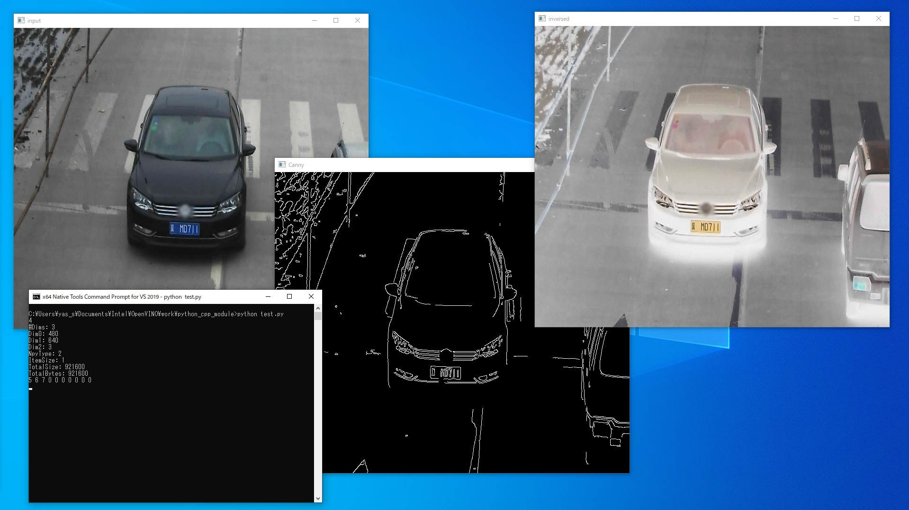

# Sample code of Python extension module

### Description:  
This project includes C++ Python extension module which handles Numpy objects. Numpy object and OpenCV Mat object interaction code example is also included.  



### How to build:
```sh
build.bat
```

### Note:  
Tested on Win10 with MSVC 2019.
